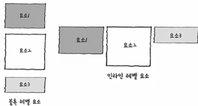
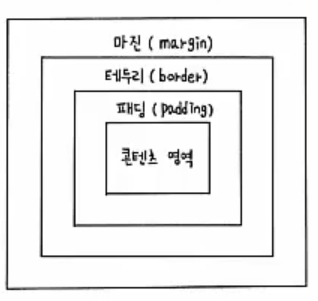
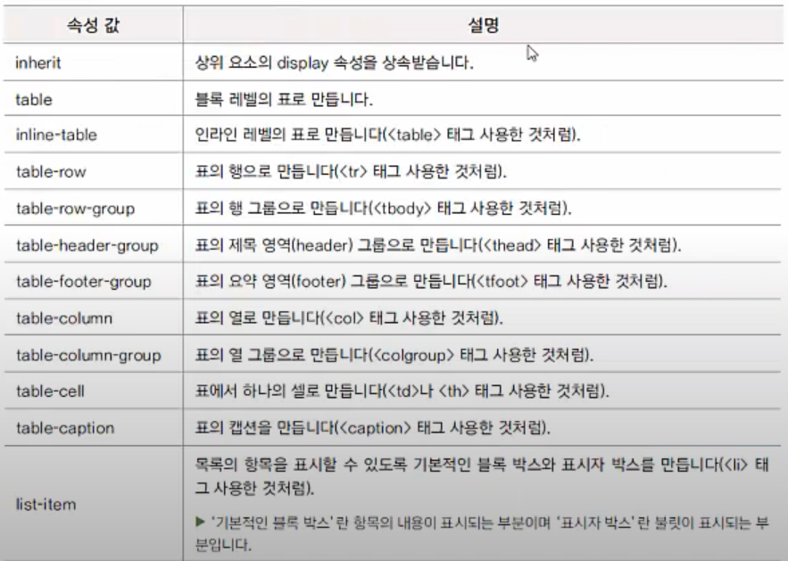

# 박스 모델

### 블록 레벨 요소

-  요소를 삽입했을 때 혼자 한 줄을 차지하는 요소
-  요소의 width가 100% , height 는 auto
-  ex) 
 
 등

### 인라인 레벨 요소

- 줄을 차지하지 않는 요소

- 화면에 표시되는 콘텐츠만 영역을 차지하고 나머지 공간에는 다른 요소가 올 수 있음

- ex)  <strong> 등

  

  

---

### 박스 모델

- 실제 콘텐츠 영역, padding, 박스의 테두리 (border), 그리고 margin 등의 요소로 구성됨

  

- width, height 속성

  - 크기: 너비나 높이 값을 px이나 cm 같은 단위와 함께 수치로 지정
  - 백분율: 박스 모델을 포함하는 부모 요소를 기준으로 너비나 높이 값을 백분율로 지정
  - auto: 박스 모델의 너비와 높이 값이 콘텐츠 양에 따라 자동으로 결정, 기본값

- 실제 콘텐츠 너비 계산하기

  - 박스 모델의 전체 너비 = width + 좌우 padding + 좌우 border

- 너비 제한

  - max-width, max-height - 기본값: none
  - min-width, min-height - 기본값: 0

---

### display 속성

- 블록 레벨 요소를 인라인 레벨 요소로 바꾸거나 반대

- display: none | contents | block | inline | inline-block | table | table-cell | flex | grid

  - inline-block: 요소를 인라인 레벨로 배치하면서 내용에는 블록 레벨 속성을 지정 (padding, margin, border를 적용위해 block 레벨 필요)

    

  