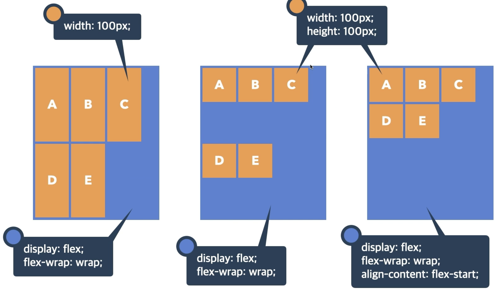
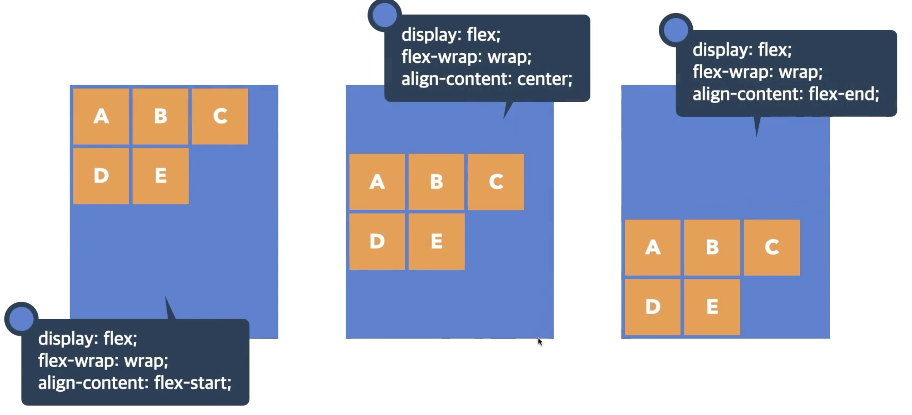
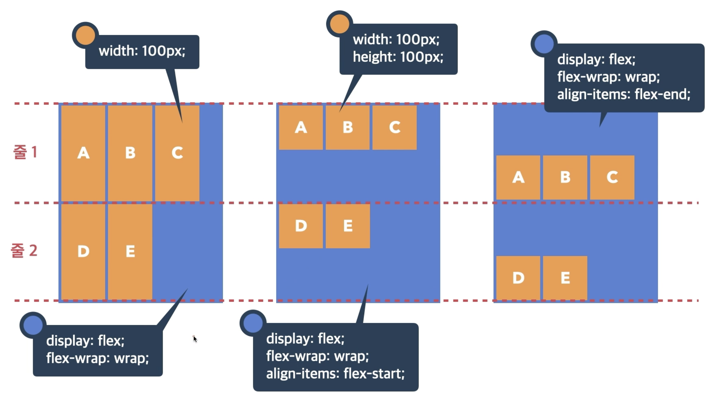
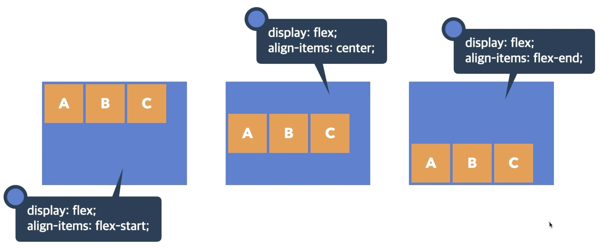

# Flex (정렬)
> Flex Container의 화면 출력(보여짐) 특성
- flex: 블록 요소와 같이 Flex Container 정의
- inline-flex: 인라인 요소와 같이 Flex Container 정의

## Container

### flex-direction
- row: 행 축 (좌=>우), default
- row-reverse: 행 축 (우=>좌)

### flex-wrap
> Flex items 묶음(줄 바꿈) 여부
- nowrap: 묶음(줄 바꿈) 없음, default
- wrap: 여러 줄로 묶음

### justify-content
> 주축의 정렬 방법 (수평)
- flex-start: Flex Items를 시작점으로 정렬, default
- flex-end: Flex Items를 끝점으로 정렬
- center: Flex Items를 가운데 정렬

### align-content
> 교차축의 여러 줄 정렬 방법 (수직), 여러 줄이 있어야 동작함
- stretch: Flex Items를 시작점으로 정렬, default
- flex-start: Flex Items를 시작점으로 정렬
- flex-end: Flex Items를 끝점으로 정렬
- center: Flex Items를 가운데 정렬 

### align-items
> 교차축의 한 줄 정렬 방법
- stretch: Flex Items를 교차축으로 늘림, default
- flex-start: Flex Items를 각 줄의 시작점으로 정렬
- flex-end: Flex Items를 각 줄의 끝점으로 정렬
- center: Flex Items를 각 줄의 가운데 정렬 

## Item

### order
> Flex Item의 순서
- default: 0
- 숫자가 작을수록 먼저

### flex-grow
> Flex Item의 증가 너비 비율
- default: 0
- 증가 비율

### flex-shrink
> Flex Item의 감소 너비 비율
- default: 1 
- 감소 비율
- 0이면 컨테이너의 크기가 줄어 공간이 부족하더라도 item 사이즈가 줄어들지 않음

### flex-basis
> Flex Item의 공간 배분 전 기본 너비
- default: auto
- 요소의 Content 너비
- px, em, rem 등 단위로 지정

