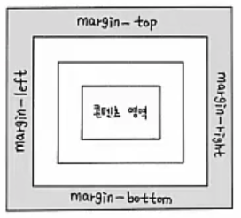
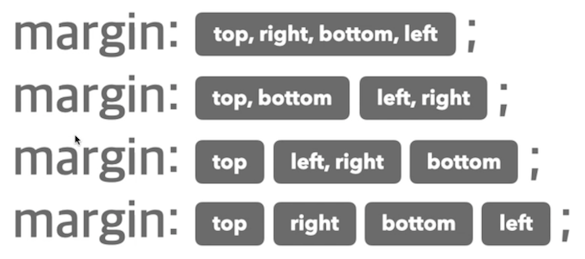
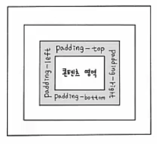
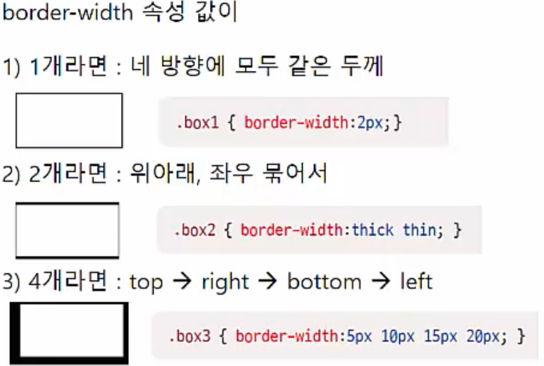
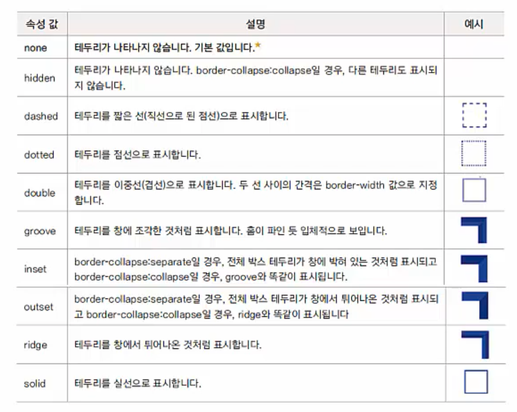
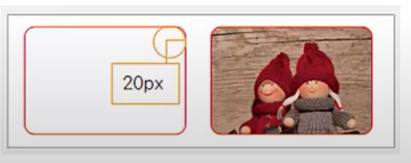
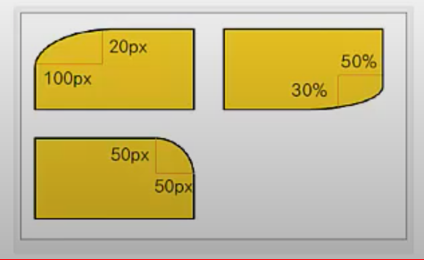

# 여백과 테두리_margin padding border

## 여백을 조절하는 속성

### margin 속성

- 요소의 외부 여백(공간)을 지정하는 단축 속성
- margin을 이용하면 요소와 요소 간의 간격 조절 가능
- margin-top | margin-right | margin-bottom | margin-left | margin: 크기 | 백분율 | auto 






### padding 속성

- 요소의 내부 여백(콘텐츠 영역과 테두리 사이의 여백)을 지정하는 단축 속성
- padding-top | padding-right | padding-bottom | padding-left | padding: 크기 | 백분율 | auto



---

## 테두리 관련 속성

### border 속성

- 요소의 테두리 선을 지정하는 단축 속성
- border: border-width border-style border-color

``` css
.container .item:first-child {
  border: 10px solid orange
}
```


### border-width 속성 (테두리 두께)

- border-top-width: 크기 | thin | medium | thick
- border-right-width: 크기 | thin | medium | thick
- border-bottom-width: 크기 | thin | medium | thick
- border-left-width: 크기 | thin | medium | thick
- border-width: 크기 | thin | medium | thick




### border-style (테두리 선의 종류)

- default: none -> 화면에 테두리 표시 안됨
- 테두리를 그리기 위해 먼저 테두리 스타일 지정




### border-color

- border-top-color: 색상
- border-righ-color: 색상
- border-bottom-color: 색상
- border-left-color: 색상
- border-color: 색상


### border-radius 

- 박스 모서리 부분을 둥글게 처리
- border-top-left-radius: 크기 | 백분율
- border-top-right-radius: 크기 | 백분율
- border-bottom-right-radius: 크기 | 백분율
- border-bottom-left-radius: 크기 | 백분율
- border-radius: 크기 | 백분율

```css
.round {
  border: 2px solid red;	/* 2px 빨강 실선 */
  border-radius: 20px;	/* 모서리 20px 만큼 라운딩 */
}
#bg {
  background: url(images/pic1.jpg) no-repeat;	/* 배경 이미지 */
  background-size: cover;	/* 영역을 다 채움 */
}
```



```css
.round1 { border-top-left-radius: 100px 50px; }	/* 가로 세로 */
.round2 { border-bottom-right-radius: 50% 30%; }
.round3 { border-top-right-radius: 50px; }
```



