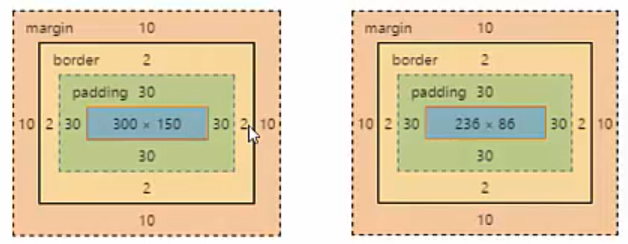
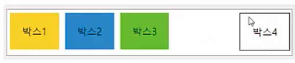
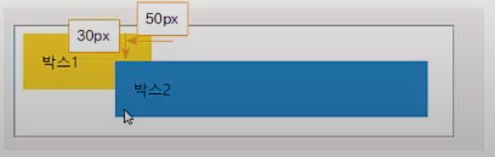
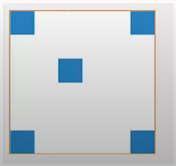
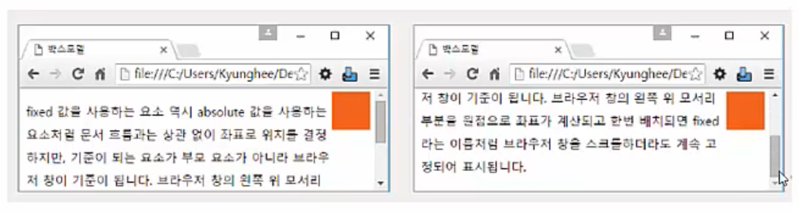
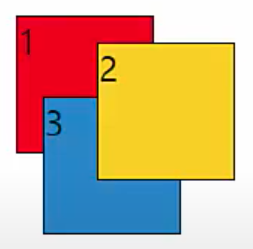

# Positioning
### Positioning 이란
> CSS를 웹 문서 요소에 적절히 배치하는 것

## 주요 속성
### box-sizing 속성
> 박스 모델의 너비 값 기준 지정

```
box-sizing: content-box | border-box
```

- content-box: width 속성 값을 콘텐츠 영역 너비 값으로 사용 (default)
- border-box: width 속성 값을 콘텐츠 영역에 테두리까지 포함한 박스 모델 전체 너비 값으로 사용

```css
.box1 {
  box-sizing: content-box; /* 콘텐츠 영역 기준 */
  width: 300px;
  height: 150px;
  margin: 10px;
  padding: 30px;
  border: 2px solid red;
}

.box2 {
  box-sizing: border-box; /* 박스 영역 기준 */
  width: 300px;
  height: 150px;
  margin: 10px;
  padding: 30px;
  border: 2px solid red;
}
```




### float 속성

> 요소를 왼쪽이나 오른쪽에 떠 있게 만듦

```
float: left | right | none
```

``` css
.box1 { float:left; }
.box2 { float:left; }
.box3 { float:left; }
.box4 { float:right; }
```




### clear 속성

> float 속성을 무효화 시키는 속성, 새로운 문서 흐름을 만드는 것

```css
clear: none | left | right | both
```

```css
.box1 { float:left; }
.box2 { float:left; }
.box3 { }
.box4 { clear: both; }
```


### position 속성

> 웹 문서 안에 요소들을 배치하기 위한 속성

```css
position: static | relative | absolute | fixed
```

- static
  -  요소를 문서의 흐름에 맞추어 배치
  -  left 속성이나 top 속성 지정 불가
  -  좌표값 넣어 정확한 위치 지정 불가
- relative
  - 요소 자신을 기준
  - 이전 요소에 자연스럽게 연결해 배치하되 위치를 지정할 수 있다.
  - 다른 요소에 의해 위치 변경 가능
  - 상대적인 위치를 사용하기 때문에 다른 요소와 조화를 이룸
  - left, top 속성 이용해 요소의 위치 옮길 수 있다.

``` css
.box1 {
  float: left;
  width: 100px;
	backgroud: #ffd800;
	margin-right: 10px;
  padding: 20px;
}

.box2 {
  float: left;
  position: relative;
  left: -50px;
  top: 30px;
	backgroud: #0094ff;
  padding: 20px;
}
```



- absolute
  - 문서의 흐름과 상관없이 원하는 위치에 요소 배치
  - 요소의 위치는 가장 가까운 부모 요소나 조상 요소 중 position: relative 인 요소
  - position이 relative인 조상이 없으면 viewport가 기준이 됨
  - left, top, right, bottom 속성 사용해 네 모서리에서 얼마나 떨어져 있는지 지정 

```css
#wrap {
  position: relative;
  width: 300px;
  height: 300px;
  border: 1px solid #ccc;
}
.box {
  position: absolute;
  width: 50px;
  height: 50px;
  backgroud: #0094ff;
}
#crd1 {
  top:0;
  left:0;
}
#crd2 {
  top:0;right:0;
}
#crd3{
  bottom:0;
  left:0;
}
#crd4 {
  bottom:0;
  right:0;
}
#crd5 {
  top:100px;
  left:100px;
}
```



- fixed
  - 문서의 흐름과는 상관없이 원하는 위치에 요소를 배치
  - 부모 요소가 아닌 브라우저 창(viewport) 기준
    - 브라우저 창 왼쪽 위 꼭지점(0,0) 기준으로 좌표 계산
  - 브라우저 창 화면을 스크롤하더라도 계속 같은 위치에 고정

``` css
#fx {
  position: fixed;
  top: 5px;
  right: 5px;
  width: 50px;
  height: 50px;
  background: #ff6a00;
}
```



 ### z-index 속성

- 요소 쌓는 순서 정하기
- z-index 값이 크면 작은 요소보다 위에 쌓인다
- z-index 값을 명시하지 않으면 1부터 시작해서 1씩 커진다

``` css
div#wrapper { position: relative; }
.b1 { z-index: 1; }
.b2 { z-index: 3; }
.b3 { z-index: 1; }
```



### 요소 쌓임 순서 (Stack order)
> 어떤 요소가 사용자와 더 가깝게 있는지(위에 쌓이는지) 결정

1. 요소에 position 속성의 값이 있는 경우 위에 쌓임 (기본값 static 제외)
2. 1번 조건이 같은 경우, z-index 속성의 값이 높을 수록 위에 쌓임
3. 1,2번 조건이 같은 경우, HTML의 다음 구조일수록 위에 쌓임

### visibility 속성

> 특정 요소를 화면에 보이거나 보이지 않게 설정하는 속성

```css
visibility: visible | hidden | collapse
```

- visible: 화면에 요소를 표시 (default)
- hidden: 화면에서 요소를 감추지만, 크기는 유지하기 때문에 배치에 영향을 미침
- collapse: 서로 겹치도록 조절하며 감춤